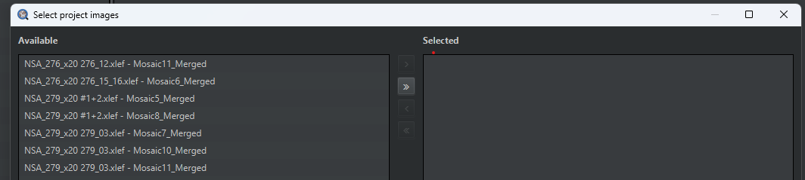

## Pipeline

Run the follwing script (to run on project, select `Run for project`)

-   export_annotation_script
    - Parameters: No parameters to modify
    - Output: Annotations (region and manually annotated pSyn) will be saved to folder with suffix (.geojson) 

-   aspect_ratio_w_circularity
    - Parameters: 
        - threshlod_level: threshold level for the green/2nd/pSyn Channel
        - red_threshold: threshold level for the red/1st Channel
        - gauss: Gauss filtering of the pSyn channel before masking (in number of pixels)
        - circularity_low: circularity level, 0 means not used
        - maxAspectRatio: maximum aspect ratio (long axis/short axis)
        - size_low = 15: minimum size to remove too small objects

    - Output: original image with a fourth channel based on the second channel where too elongated and too small objects will be removed, while annoations will be lost

**Make sure to load the new images to the project and move them to Selected by clicking the `>>` arrow (see attached image)**

-   import_annoation_script
    - Parameters: No parameters to modify
    - Output: image with a fourth channel from previous step and with annoations loaded

-   cell_detection 
    - Parameters: No parameters to modify
    - Output: image with a fourth channel from previous step and with annoations loaded
    - Note: need to make sure that the region annoation is before the pSyn annotation
- run_object_classifier
    - Parameters: `classifier name`: the classifier created
    - Output: image with a fourth channel from previous step and with annoations loaded
    - Note: need to make sure that the region annoation is before the pSyn annotation

Classify -> Object classification -> Create single measurement classifier

